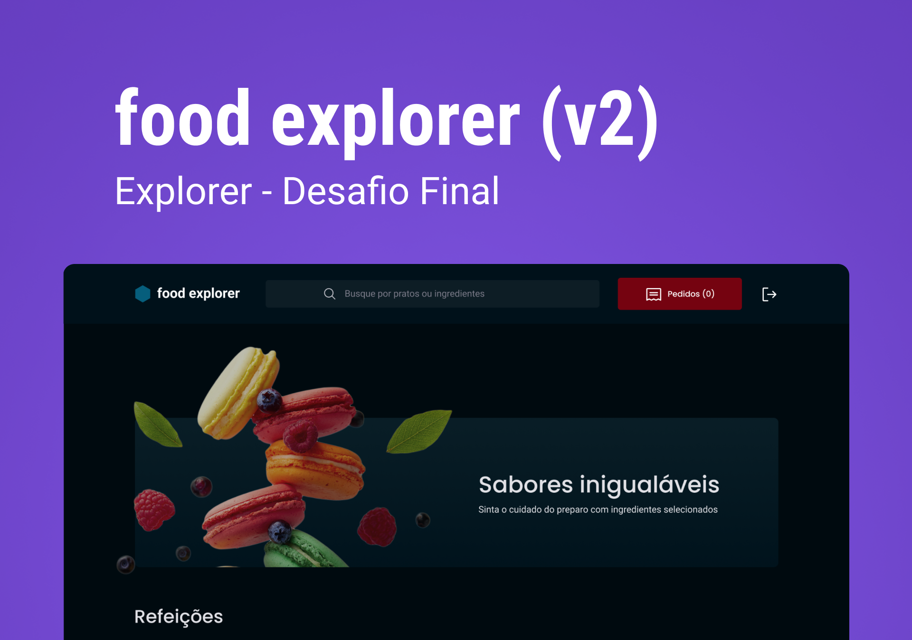

<h1 align="center"> Food Explorer - BackEnd </h1>

<p align="center">
Aplicação para ser usada como cardápio digital ou menu interativo para um restaurante, lanchonete, etc.
</p>

<p align="center">
  <a href="#-tecnologias">Tecnologias</a>&nbsp;&nbsp;&nbsp;|&nbsp;&nbsp;&nbsp;
  <a href="#-projeto">Projeto</a>&nbsp;&nbsp;&nbsp;|&nbsp;&nbsp;&nbsp;
  <a href="#-utilzação">Utilização</a>&nbsp;&nbsp;&nbsp;|&nbsp;&nbsp;&nbsp;
</p>

<p align="center">
  
</p>

<br>

<p align="center">
  
</p>

## 🚀 Tecnologias

Esse projeto foi desenvolvido com as seguintes tecnologias:

- NodeJS
- Express
- SQLite
- Knex
- JWT
- Multer

##

## 💡 Utilização

  Você também pode executá-la em sua máquina localmente. Certifique-se de ter o Node.js e o npm instalados antes de prosseguir com as etapas abaixo:

  1. Clone o projeto:

  ```
  git clone https://github.com/Filipemtb/FoodExplorer-BackEnd.git

  gh repo clone Filipemtb/FoodExplorer-BackEnd
  ```

  2. Acesse a pasta do projeto:

  ```
  $ cd FoodExplorer-BackEnd
  ```

  3. Instale as dependências:

  ```
  $ npm install
  ```

  4. Inicie o servidor:

  ```
  $ npm run dev
  ```


## 👨‍💻 Veja o [FrontEnd](https://github.com/Filipemtb/FoodExplorer-FrontEnd) 

## 💻 Projeto

- Desafio final do curso Explorer da Rocketseat.

- ⚠️ Importante: Este projeto está utilizando uma hospedagem gratuita para o seu backend, portanto, pode haver atrasos no tempo de resposta do servidor.
##